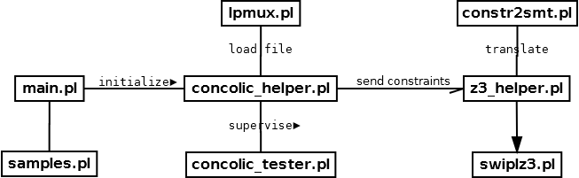
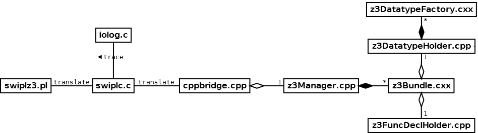

# Complements

Because my master thesis is now outdated, I made this file to complete it and provide up-to-date information about this repository.

### Class Diagrams

— main.pl: the concolic tool main entry point
— samples.pl: a loader to test the samples which are defined within the file "samples.txt"
— concolic_tester.pl: the implementation of the concolic testing algorithm
— concolic_helper.pl: a supervisor which provides tools to assist the concolic algorithm
— lpmux.pl: a manager which handles the instrumented logic program
— constr2smt.pl: translates constraints into SMT assertions
— z3_helper.pl: an intermediate for the concolic algorithm to use z3 primitives

— swiplz3.pl: an intermediate to call z3 primitives using SWI-Prolog
— swiplc.c: a bridge between C and SWI-Prolog through a foreign language interface
— iolog.c: write a trace of each call to z3 primitives for debugging purposes into "swiplz3.log"
— cppbridge.cpp: a syntactic bridge between C and C++
— z3Manager.cpp: a manager which handles interactions with the Z3 API
— z3Bundle.cxx: a data bundle which wraps a Z3 context
— z3DatatypeFactory.cxx: a factory that builds datatypes on demand
— z3DatatypeHolder.cpp: holds all declared datatypes
— z3FuncDeclHolder.cpp: holds all declared functions

### Swiplz3 Primitives

The following predicates are the currently available swiplz3 primitives:

:- type datatype ---> [string, list([string, list([string, string])])]. % [DtName, list([CtorName, list([AccName, AccType])])]
:- type checksat_result ---> 'sat' ; 'unsat' ; 'unknown'.

:- pred z3_mk_config.
:- pred z3_del_config.
:- pred z3_set_param_value(+Param: string, +Value: string).
:- pred z3_mk_context(-ContextID: integer).
:- pred z3_del_context(+ContextID: integer).
:- pred z3_mk_solver(+ContextID: integer).
:- pred z3_del_solver(+ContextID: integer).
:- pred z3_push(+ContextID: integer).
:- pred z3_pop(+ContextID: integer).
:- pred z3_mk_datatypes(+ContextID: integer, +TplVars: list(string), +Datatypes: list(datatype)).
:- pred z3_mk_sort(+ContextID: integer, +SortName: string, +BaseName: string).
:- pred z3_mk_vars(+ContextID: integer, +VarNames: list(string), +VarType: string).
:- pred z3_mk_func(+ContextID: integer, +FuncName: string, +FuncArgs: list(string), +RetType: string, +FuncBody: string, +Recursive: boolean).
:- pred z3_declare_fun(+ContextID: integer, +FuncName: string, +FuncArgs: list(string), +RetType: string).
:- pred z3_define_fun(+ContextID: integer, +FuncName: string, +FuncArgs: list(string), +RetType: string, +FuncBody: string).
:- pred z3_define_fun_rec(+ContextID: integer, +FuncName: string, +FuncArgs: list(string), +RetType: string, +FuncBody: string).
:- pred z3_assert_string(+ContextID: integer, +Assertion: string).
:- pred z3_check_sat(+ContextID: integer, -Result: checksat_result).
:- pred z3_get_model_to_string(+ContextID: integer, -Model: string).
:- pred z3_eval_model_var(+ContextID: integer, +VarName: string, -VarValue: term).

### Swiplz3_tester instructions

The following SMTLIB2 instructions are mapped to current swiplz3 primitives within the 'swiplz3_tester' environment:

| Instruction | Details |
| --- | --- |
| (push) | creates a new scope |
| (pop) | removes the last scope |
| (declare-datatypes (OptTypeNames...) Datatypes) | declares datatypes |
| (declare-sort SortName) | declares a sort |
| (define-sort SortName (OptTypeNames...) BaseName) | defines a sort |
| ($declare-consts (ConstNames...) ConstType) | declares multiple constants |
| (declare-const ConstName ConstType) | declares a single constant |
| (declare-fun FuncName (FuncArgs...) FuncRet) | declares a function |
| (define-fun FuncName (FuncArgs...) FuncRet FuncBody) | defines a function |
| (define-fun-rec FuncName (FuncArgs...) FuncRet FuncBody) | defines a recursive function |
| (assert Formula) | asserts a formula |
| (check-sat) | checks if a model exists |
| (get-model) | prints a model (if any) |
| ($eval-model-const ConstName) | defines a constant using the model |
| (reset) | resets the current Z3 context |